Grant Proposal | [60 - Financial crime prevention and risk intelligence on-chain tool](https://portal.devxdao.com/public-proposals/60)
------------ | -------------
Milestone | 3
Milestone Title | Analytics/Compliance Layer
OP | Aberto
Reviewer | M Chad ABAHMANE


# Milestone Details

## Details & Acceptance Criteria

**Details of what will be delivered in milestone:**

- Data analytics and compliance layer with functionalities to spot potential fraud and/or financial crime

**Acceptance criteria:**

- Incorporate an open source data visualization interface (eg. Kibana, Graphana) and provide a couple of analytics charts


**Additional notes regarding submission from OP:**
There was a major code refactor on the ORI project:
1. The project now is broken into several modules
    - ori-api (containing the REST API and database models)
    - ori-chains (contiaining the crawlers for different chains)
    - ori-client (a simple java client to use ori-api)
    - ori-dashboard (the deliverable for this milestone)
    - ori-frontend (the deliverable for the previous milestone)
    - ori-risk-metric (the module responsible for the risk metric calculations)
    - ori-shared (an implementation of DTO objects)
2. We migrated from a no-sql persistency layer (Elastic Search) to Postgresql together with hibernate
3. All dockers, jars are built with ./mvwn package command
4. The front-end also has been modified to add the capability to choose the chain
5. An ETH crawler has also been added to the project

**Notes from previous review**

With respect to this milestone specifically, after compiling the project and crawling the blockchain to populate the database (note that this might take a while) it is possible to access a preloaded dashboard after running the appropriate docker file through localhost:8088 with login: admin and password:admin (or any other value specified to the docker container running the dashboard)
**REST API**
- Swagger-ui: http://localhost:8080/q/swagger-ui/
- Swagger file: http://localhost:8080/swagger

**GraphQL API**
- GraphQL-ui: http://localhost:8080/q/graphql-ui/
- Schema: http://localhost:8080/graphql/schema.graphql

## Milestone Submission

The following milestone assets/artifacts were submitted for review:

Repository | Revision Reviewed
------------ | -------------
https://github.com/syntifi/ori/tree/main/ori-dashboard | 118a181

# Install & Usage Testing Procedure and Findings

Following the instructions in the README file of the repositoty : https://github.com/syntifi/ori and the file provided as a guide for this milestone

https://github.com/syntifi/ori/blob/main/TLDR-CSPR.md, the reviewer was
able to :

0- Install required dependencies on an Ubuntu 20.04 cloud server:

```console
Java 11 or above
Maven (3.8.1 or above)
Docker
Docker compose (version 1.29.2 or above)
Node.js (>=14.0.0) 
```

1. Test and build the project on an Ubuntu 20.04 cloud server

```bash
~/reviews/ori$ sudo ./mvnw clean compile

```
[INFO] Scanning for projects...
[INFO] ------------------------------------------------------------------------
[INFO] Reactor Build Order:
[INFO]
[INFO] com.syntifi.ori:ori                                                [pom]
[INFO] ori-shared                                                         [jar]
[INFO] ori-risk-metric                                                    [jar]
[INFO] ori-api                                                            [jar]
[INFO] ori-client                                                         [jar]
[INFO] ori-chains                                                         [pom]
[INFO] ori-chain-base                                                     [jar]
[INFO] ori-cspr                                                           [jar]
[INFO] ori-eth                                                            [jar]
[INFO] ori-frontend                                                       [pom]
[INFO] ori-dashboard                                                      [pom]
[INFO]
[INFO] ------------------------< com.syntifi.ori:ori >-------------------------
[INFO] Building com.syntifi.ori:ori 0.2.0-SNAPSHOT                       [1/11]
[INFO] --------------------------------[ pom ]---------------------------------
[INFO]
[INFO] --- maven-clean-plugin:3.1.0:clean (default-clean) @ ori ---
[INFO]
[INFO] ---------------------< com.syntifi.ori:ori-shared >---------------------
[INFO] Building ori-shared 0.1.0-SNAPSHOT                                [2/11]
[INFO] --------------------------------[ jar ]---------------------------------
[INFO]
[INFO] --- maven-clean-plugin:3.1.0:clean (default-clean) @ ori-shared ---
[INFO] Deleting /home/abahmane/reviews/ori/ori-shared/target
[INFO]
[INFO] --- jacoco-maven-plugin:0.8.7:prepare-agent (prepare-agent) @ ori-shared ---
[INFO] argLine set to -javaagent:/root/.m2/repository/org/jacoco/org.jacoco.agent/0.8.7/org.jacoco.agent-0.8.7-runtime.jar=destfile=/home/abahmane/reviews/ori/ori-shared/target/jacoco.exec
[INFO]
[INFO] --- maven-resources-plugin:3.2.0:resources (default-resources) @ ori-shared ---
[INFO] Using 'UTF-8' encoding to copy filtered resources.
[INFO] Using 'UTF-8' encoding to copy filtered properties files.
[INFO] Copying 1 resource
[INFO]
[INFO] --- maven-compiler-plugin:3.8.1:compile (default-compile) @ ori-shared ---
[INFO] Changes detected - recompiling the module!
[INFO] Compiling 6 source files to /home/abahmane/reviews/ori/ori-shared/target/classes
[INFO]
[INFO] ------------------< com.syntifi.ori:ori-risk-metric >-------------------
[INFO] Building ori-risk-metric 0.1.0-SNAPSHOT                           [3/11]
[INFO] --------------------------------[ jar ]---------------------------------
[INFO]
[INFO] --- maven-clean-plugin:3.1.0:clean (default-clean) @ ori-risk-metric ---
[INFO] Deleting /home/abahmane/reviews/ori/ori-risk-metric/target
[INFO]
[INFO] --- jacoco-maven-plugin:0.8.7:prepare-agent (prepare-agent) @ ori-risk-metric ---
[INFO] argLine set to -javaagent:/root/.m2/repository/org/jacoco/org.jacoco.agent/0.8.7/org.jacoco.agent-0.8.7-runtime.jar=destfile=/home/abahmane/reviews/ori/ori-risk-metric/target/jacoco.exec
[INFO]
[INFO] --- maven-resources-plugin:3.2.0:resources (default-resources) @ ori-risk-metric ---
[INFO] Using 'UTF-8' encoding to copy filtered resources.
[INFO] Using 'UTF-8' encoding to copy filtered properties files.
[INFO] Copying 1 resource
[INFO]
[INFO] --- maven-compiler-plugin:3.8.1:compile (default-compile) @ ori-risk-metric ---
[INFO] Changes detected - recompiling the module!
[INFO] Compiling 1 source file to /home/abahmane/reviews/ori/ori-risk-metric/target/classes
[INFO]
[INFO] ----------------------< com.syntifi.ori:ori-api >-----------------------
[INFO] Building ori-api 0.2.0-SNAPSHOT                                   [4/11]
[INFO] --------------------------------[ jar ]---------------------------------
[INFO]
[INFO] --- maven-clean-plugin:3.1.0:clean (default-clean) @ ori-api ---
[INFO] Deleting /home/abahmane/reviews/ori/ori-api/target
[INFO]
[INFO] --- maven-resources-plugin:3.2.0:resources (default-resources) @ ori-api ---
[INFO] Using 'UTF-8' encoding to copy filtered resources.
[INFO] Using 'UTF-8' encoding to copy filtered properties files.
[INFO] Copying 2 resources
[INFO] Copying 9 resources to frontend
[INFO]
[INFO] --- quarkus-maven-plugin:2.7.1.Final:generate-code (default) @ ori-api ---
[INFO]
[INFO] --- maven-compiler-plugin:3.8.1:compile (default-compile) @ ori-api ---
[INFO] Changes detected - recompiling the module!
[INFO] Compiling 30 source files to /home/abahmane/reviews/ori/ori-api/target/classes
[INFO]
[INFO] ---------------------< com.syntifi.ori:ori-client >---------------------
[INFO] Building ori-client 0.1.0-SNAPSHOT                                [5/11]
[INFO] --------------------------------[ jar ]---------------------------------
[INFO]
[INFO] --- maven-clean-plugin:3.1.0:clean (default-clean) @ ori-client ---
[INFO] Deleting /home/abahmane/reviews/ori/ori-client/target
[INFO]
[INFO] --- jacoco-maven-plugin:0.8.7:prepare-agent (prepare-agent) @ ori-client ---
[INFO] argLine set to -javaagent:/root/.m2/repository/org/jacoco/org.jacoco.agent/0.8.7/org.jacoco.agent-0.8.7-runtime.jar=destfile=/home/abahmane/reviews/ori/ori-client/target/jacoco.exec
[INFO]
[INFO] --- maven-resources-plugin:3.2.0:resources (default-resources) @ ori-client ---
[INFO] Using 'UTF-8' encoding to copy filtered resources.
[INFO] Using 'UTF-8' encoding to copy filtered properties files.
[INFO] Copying 1 resource
[INFO]
[INFO] --- maven-compiler-plugin:3.8.1:compile (default-compile) @ ori-client ---
[INFO] Changes detected - recompiling the module!
[INFO] Compiling 3 source files to /home/abahmane/reviews/ori/ori-client/target/classes
[INFO]
[INFO] ---------------------< com.syntifi.ori:ori-chains >---------------------
[INFO] Building ori-chains 0.1.0-SNAPSHOT                                [6/11]
[INFO] --------------------------------[ pom ]---------------------------------
[INFO]
[INFO] --- maven-clean-plugin:3.1.0:clean (default-clean) @ ori-chains ---
[INFO]
[INFO] --- jacoco-maven-plugin:0.8.7:prepare-agent (prepare-agent) @ ori-chains ---
[INFO] argLine set to -javaagent:/root/.m2/repository/org/jacoco/org.jacoco.agent/0.8.7/org.jacoco.agent-0.8.7-runtime.jar=destfile=/home/abahmane/reviews/ori/ori-chains/target/jacoco.exec
[INFO]
[INFO] ---------------< com.syntifi.ori.chains:ori-chain-base >----------------
[INFO] Building ori-chain-base 0.1.0-SNAPSHOT                            [7/11]
[INFO] --------------------------------[ jar ]---------------------------------
[INFO]
[INFO] --- maven-clean-plugin:3.1.0:clean (default-clean) @ ori-chain-base ---
[INFO] Deleting /home/abahmane/reviews/ori/ori-chains/ori-chain-base/target
[INFO]
[INFO] --- jacoco-maven-plugin:0.8.7:prepare-agent (prepare-agent) @ ori-chain-base ---
[INFO] argLine set to -javaagent:/root/.m2/repository/org/jacoco/org.jacoco.agent/0.8.7/org.jacoco.agent-0.8.7-runtime.jar=destfile=/home/abahmane/reviews/ori/ori-chains/ori-chain-base/target/jacoco.exec
[INFO]
[INFO] --- maven-resources-plugin:3.2.0:resources (default-resources) @ ori-chain-base ---
[INFO] Using 'UTF-8' encoding to copy filtered resources.
[INFO] Using 'UTF-8' encoding to copy filtered properties files.
[INFO] Copying 1 resource
[INFO]
[INFO] --- maven-compiler-plugin:3.8.1:compile (default-compile) @ ori-chain-base ---
[INFO] Changes detected - recompiling the module!
[INFO] Compiling 16 source files to /home/abahmane/reviews/ori/ori-chains/ori-chain-base/target/classes
[INFO]
[INFO] ------------------< com.syntifi.ori.chains:ori-cspr >-------------------
[INFO] Building ori-cspr 0.1.0-SNAPSHOT                                  [8/11]
[INFO] --------------------------------[ jar ]---------------------------------
[INFO]
[INFO] --- maven-clean-plugin:3.1.0:clean (default-clean) @ ori-cspr ---
[INFO] Deleting /home/abahmane/reviews/ori/ori-chains/ori-cspr/target
[INFO]
[INFO] --- jacoco-maven-plugin:0.8.7:prepare-agent (prepare-agent) @ ori-cspr ---
[INFO] argLine set to -javaagent:/root/.m2/repository/org/jacoco/org.jacoco.agent/0.8.7/org.jacoco.agent-0.8.7-runtime.jar=destfile=/home/abahmane/reviews/ori/ori-chains/ori-cspr/target/jacoco.exec
[INFO]
[INFO] --- maven-resources-plugin:3.2.0:resources (default-resources) @ ori-cspr ---
[INFO] Using 'UTF-8' encoding to copy filtered resources.
[INFO] Using 'UTF-8' encoding to copy filtered properties files.
[INFO] Copying 1 resource
[INFO]
[INFO] --- maven-compiler-plugin:3.8.1:compile (default-compile) @ ori-cspr ---
[INFO] Changes detected - recompiling the module!
[INFO] Compiling 6 source files to /home/abahmane/reviews/ori/ori-chains/ori-cspr/target/classes
[INFO]
[INFO] -------------------< com.syntifi.ori.chains:ori-eth >-------------------
[INFO] Building ori-eth 0.1.0-SNAPSHOT                                   [9/11]
[INFO] --------------------------------[ jar ]---------------------------------
[INFO]
[INFO] --- maven-clean-plugin:3.1.0:clean (default-clean) @ ori-eth ---
[INFO] Deleting /home/abahmane/reviews/ori/ori-chains/ori-eth/target
[INFO]
[INFO] --- jacoco-maven-plugin:0.8.7:prepare-agent (prepare-agent) @ ori-eth ---
[INFO] argLine set to -javaagent:/root/.m2/repository/org/jacoco/org.jacoco.agent/0.8.7/org.jacoco.agent-0.8.7-runtime.jar=destfile=/home/abahmane/reviews/ori/ori-chains/ori-eth/target/jacoco.exec
[INFO]
[INFO] --- maven-resources-plugin:3.2.0:resources (default-resources) @ ori-eth ---
[INFO] Using 'UTF-8' encoding to copy filtered resources.
[INFO] Using 'UTF-8' encoding to copy filtered properties files.
[INFO] Copying 1 resource
[INFO]
[INFO] --- maven-compiler-plugin:3.8.1:compile (default-compile) @ ori-eth ---
[INFO] Changes detected - recompiling the module!
[INFO] Compiling 6 source files to /home/abahmane/reviews/ori/ori-chains/ori-eth/target/classes
[INFO]
[INFO] --------------------< com.syntifi.ori:ori-frontend >--------------------
[INFO] Building ori-frontend 0.1.0-SNAPSHOT                             [10/11]
[INFO] --------------------------------[ pom ]---------------------------------
[INFO]
[INFO] --- maven-clean-plugin:3.1.0:clean (default-clean) @ ori-frontend ---
[INFO]
[INFO] --- exec-maven-plugin:3.0.0:exec (npm-install) @ ori-frontend ---

up to date, audited 2234 packages in 2s

212 packages are looking for funding
  run `npm fund` for details

17 moderate severity vulnerabilities

To address issues that do not require attention, run:
  npm audit fix

To address all issues (including breaking changes), run:
  npm audit fix --force

Run `npm audit` for details.
[INFO]
[INFO] --- exec-maven-plugin:3.0.0:exec (npm-build) @ ori-frontend ---

> frontend@0.1.0 build
> react-scripts build

Creating an optimized production build...
Compiled with warnings.

Failed to parse source map from '/home/abahmane/reviews/ori/ori-frontend/src/css/vis-network.css.map' file: Error: ENOENT: no such file or directory, open '/home/abahmane/reviews/ori/ori-frontend/src/css/vis-network.css.map'

Search for the keywords to learn more about each warning.
To ignore, add // eslint-disable-next-line to the line before.

File sizes after gzip:

  487.98 kB  build/static/js/main.2b1021f1.js
  30.78 kB   build/static/css/main.9b26f175.css

The project was built assuming it is hosted at /.
You can control this with the homepage field in your package.json.

The build folder is ready to be deployed.
You may serve it with a static server:

  npm install -g serve
  serve -s build

Find out more about deployment here:

  https://cra.link/deployment

[INFO]
[INFO] -------------------< com.syntifi.ori:ori-dashboard >--------------------
[INFO] Building ori-dashboard 0.1.0-SNAPSHOT                            [11/11]
[INFO] --------------------------------[ pom ]---------------------------------
[INFO]
[INFO] --- maven-clean-plugin:3.1.0:clean (default-clean) @ ori-dashboard ---
[INFO] ------------------------------------------------------------------------
[INFO] Reactor Summary:
[INFO]
[INFO] com.syntifi.ori:ori 0.2.0-SNAPSHOT ................. SUCCESS [  0.041 s]
[INFO] ori-shared 0.1.0-SNAPSHOT .......................... SUCCESS [  0.970 s]
[INFO] ori-risk-metric 0.1.0-SNAPSHOT ..................... SUCCESS [  0.263 s]
[INFO] ori-api 0.2.0-SNAPSHOT ............................. SUCCESS [  1.741 s]
[INFO] ori-client 0.1.0-SNAPSHOT .......................... SUCCESS [  0.245 s]
[INFO] ori-chains 0.1.0-SNAPSHOT .......................... SUCCESS [  0.025 s]
[INFO] ori-chain-base 0.1.0-SNAPSHOT ...................... SUCCESS [  0.476 s]
[INFO] ori-cspr 0.1.0-SNAPSHOT ............................ SUCCESS [  0.250 s]
[INFO] ori-eth 0.1.0-SNAPSHOT ............................. SUCCESS [  0.260 s]
[INFO] ori-frontend 0.1.0-SNAPSHOT ........................ SUCCESS [ 22.674 s]
[INFO] ori-dashboard 0.1.0-SNAPSHOT ....................... SUCCESS [  0.002 s]
[INFO] ------------------------------------------------------------------------
[INFO] BUILD SUCCESS
[INFO] ------------------------------------------------------------------------
[INFO] Total time:  27.553 s
[INFO] Finished at: 2022-03-19T15:43:35+01:00
[INFO] ------------------------------------------------------------------------
```


2. Build libs, jars and images

```bash
~/reviews/ori$ sudo ./mvnw package -DskipTests
```

Output: 


3. Create a docker network ori

```bash
~/reviews/ori$ docker network create ori
```

4. Start postgresql and api modules (docker images)

```bash
~/reviews/ori$ docker-compose -f ./ori-api/src/main/docker/docker-compose-jvm.yml up -d
Creating docker_ori-postgresql_1 ... done
Creating docker_ori-api_1        ... done
```

the reviewer was able to verify that the 2 docker images were up :

```bash
docker-compose -f ori-api/src/main/docker/docker-compose-jvm.yml ps
         Name                        Command              State                    Ports
----------------------------------------------------------------------------------------------------------
docker_ori-api_1          /deployments/run-java.sh        Up      0.0.0.0:8080->8080/tcp,:::8080->8080/tcp
docker_ori-postgresql_1   docker-entrypoint.sh postgres   Up      0.0.0.0:5432->5432/tcp,:::5432->5432/tcp
```

5. Launch the crawler for CSPR chain

```bash
~/reviews/ori$ docker-compose -f ./ori-chains/ori-cspr/src/main/docker/docker-compose.yml up -d
Creating docker_ori-cspr_1 ... done
```

the reviewer was able to verify that the docker image was up :

 ```bash
 ~/reviews/ori$ docker-compose -f ori-chains/ori-cspr/src/main/docker/docker-compose.yml ps
      Name              Command        State   Ports
----------------------------------------------------
docker_ori-cspr_1   /cnb/process/web   Up
 ```
The reviewer was then able to check crawling is up and running using the following command line :

 ```bash
docker-compose -f ori-chains/ori-cspr/src/main/docker/docker-compose.yml logs -f
 ```
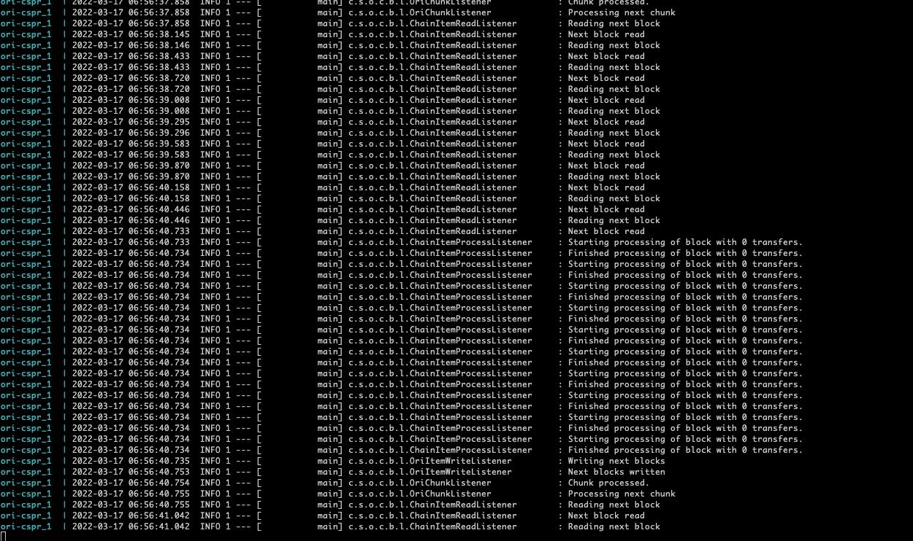

The crawler took a long time (at least a day) to populate the database.
The crawler retrieves all the blocks, accounts and transactions of the CSPR chain from Genesis (via RPC calls). 
The OP also offered the alternative to use an image with a database containing only recent blocks.
the reviewer wanted to make sure that the crawler completed the whole process of populating the data without errors.

6. Access the front-end

The reviewer was able to check that the front end webapp is up and running.
He could then access it using the url : http://server_ip_address:8080
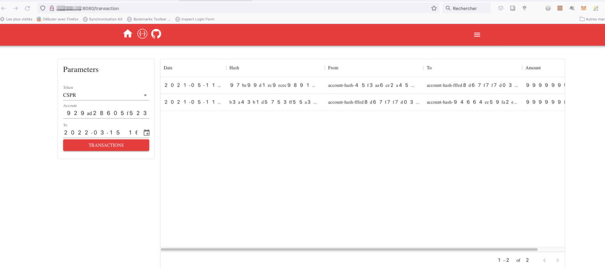

7. Check the database was populated 

The reviewer used  pgAdmin program to check the datas was successfully injected by the crawling process :
He verified 3 main tables :
   
   * Account :

   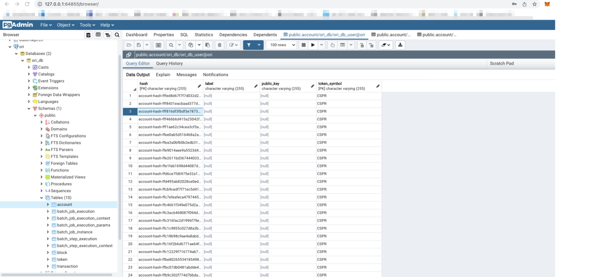 

   * Block:

   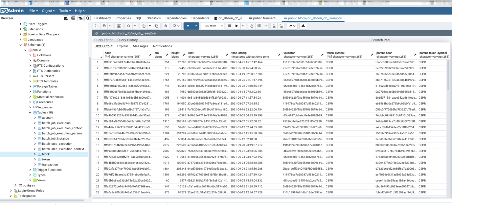
   
   * Transaction:

   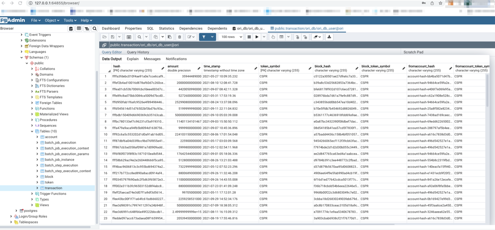
   


9. Start the dashboard

```bash
~/reviews/ori$ docker-compose -f ori-dashboard/docker/docker-compose.yml up -d
Creating docker_dashboard_1 ... done
```

The reviewer was then able to check the dashboard is up and running using the following command line :

```bash
~/reviews/ori$ docker-compose -f ori-dashboard/docker/docker-compose.yml ps
       Name                   Command               State                        Ports
--------------------------------------------------------------------------------------------------------
docker_dashboard_1   sh ./docker/entrypoint.sh   Up (healthy)   0.0.0.0:8088->8088/tcp,:::8088->8088/tcp
```


This review focuses on the dashboard part.
The dashboard module uses the Apache Superset which is an open  data visualization and  exploration platform.
It is used here to have data analysis on transactions on the Casper blockchain. These analysis can be used for
coin tracing for example (used in AML).
the dashboaad is currently limited to transactions analysis but can be extended to explore other datas  such as blocks, validators etc ...
In this review,  we will carry out test scenarios on the following dashboard features :

- Transactions Monitor
- Charts 

1. Access the dashboard

The reviewer was able to connect to teh dashboard using  credentials provided in the Additional notes above.

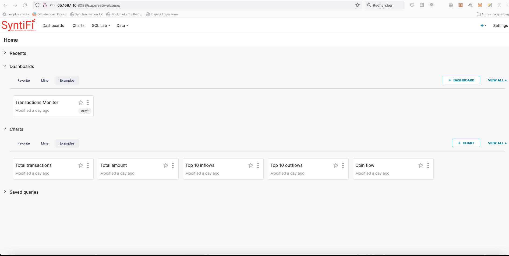


2. Transactions Monitor
 
The reviewer was then able to load the transactions monitor  

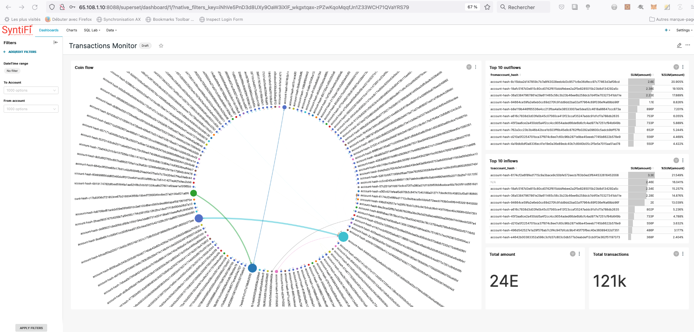


The page displays a chart representing the coin flows (limited to 100 rows) and  informations like :

- Top 10 outflows
- Top 10 inflows
- Total amount
- Total transactions

###Filtering

The reviewer was able to filter datas using :

**'From Account' filter :**

From Account = account-hash-8c15bba2d147859c7b7a8f43028eeb4d3c9571c6e36dfecc97c77463d3af08cd

The dashboard was successfully loaded with all the transactions having this account as source

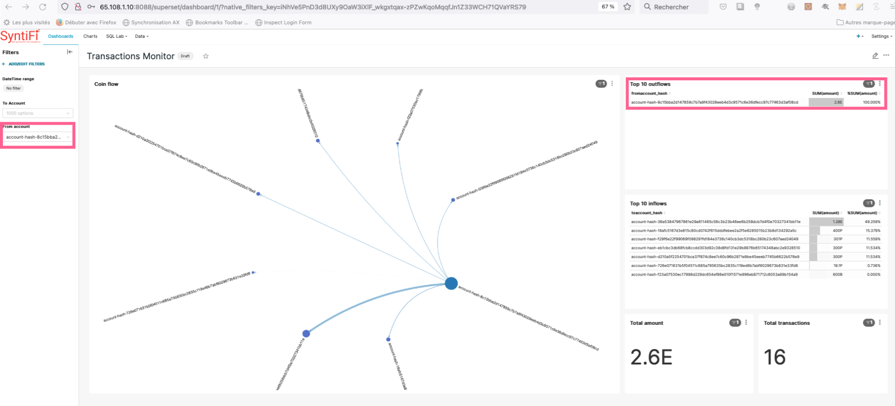


**'To Account' filter :**

From Account =  account-hash-00005f6d67c5303c206f5e678f4eb52703dc0665a7d08a12c8c6b55867da654d

The dashboard was successfully loaded with all the transactions having this account as recipient

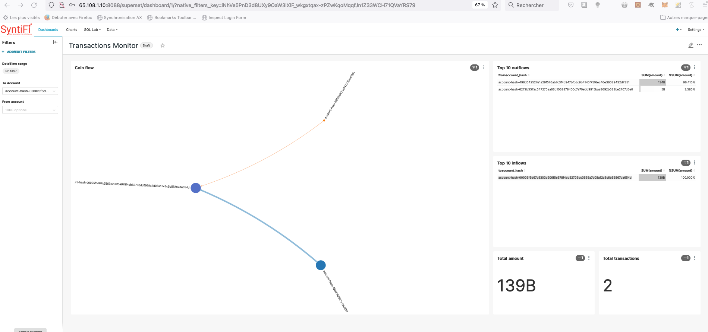


###adding filters

The dashboard offers teh possibility to add to the fields used to filter transaction datas.
The reviewer was able to add a new filter on the amount of transaction. 

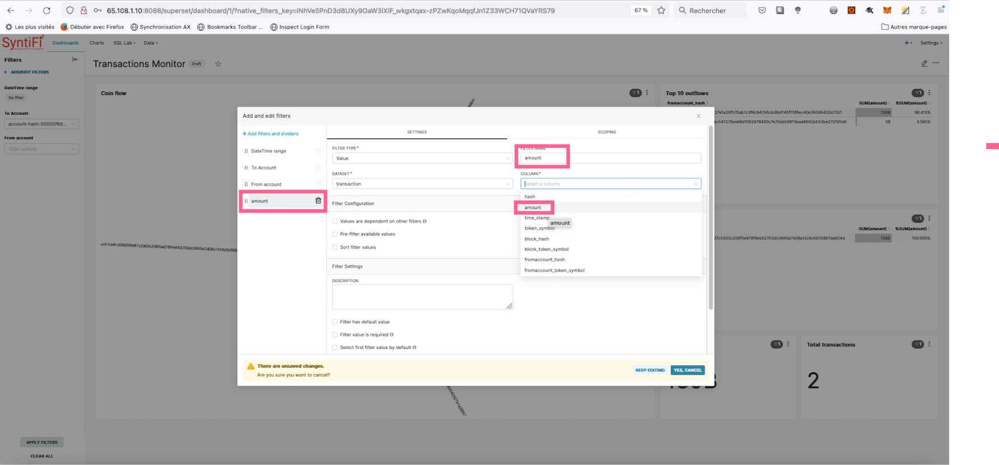

Then he applied this filter with the value = 11 500 000 000 (motes). The datas was successfully loaded.

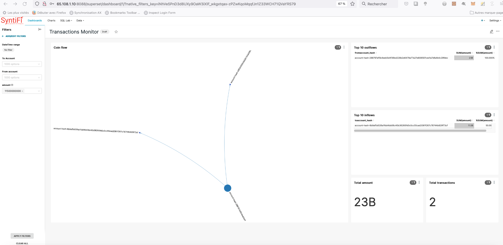


3- Charts

3.1 Displaying and updating charts

The dashboard offers the possibility of adding charts to visualize  transaction datas.

There are already 5 configured charts (embedded in the Transaction Monitor): 

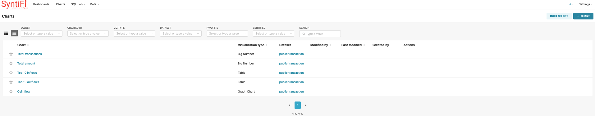

The reviewer was able to load all of these charts and apply changes to them.

* Example with coin flow chart : 

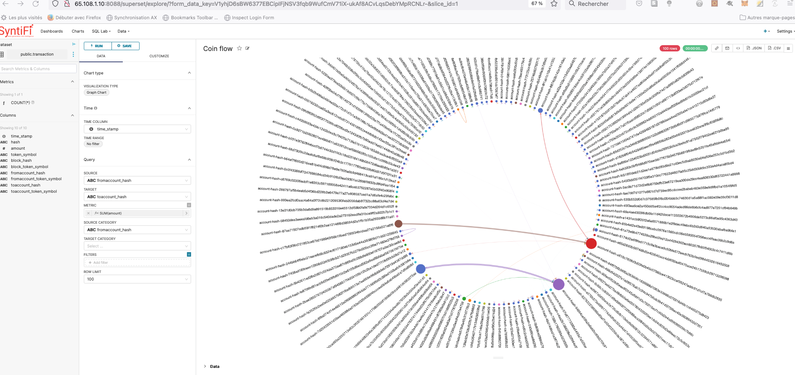

The reviewer changed the 'Metric' filter from 'Count' to 'MAX':

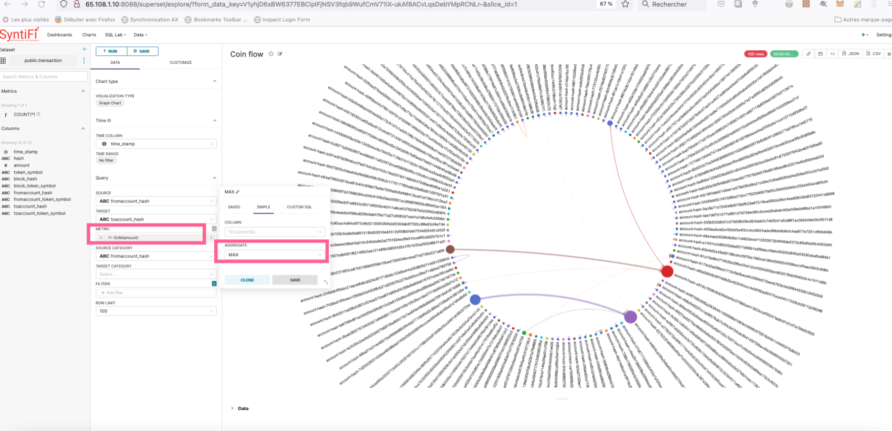

The  coin flow chart was updated accodingly. 

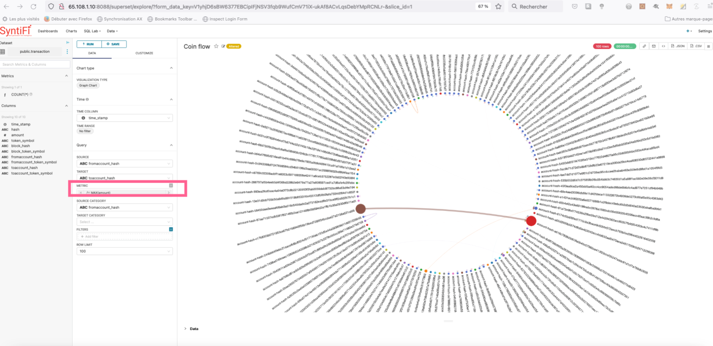

The reviewer increased the 'Row limit' filter from 100  10000 rows (transaction hashes) and was able to update the chart:

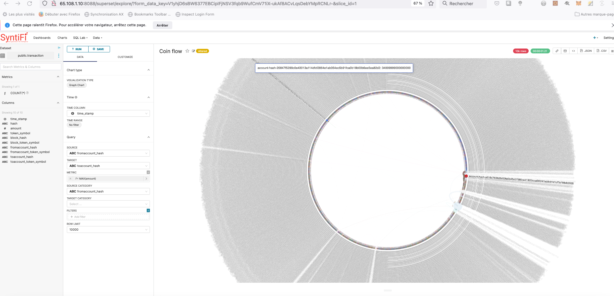

3.2 Adding new charts
The tool offers the possibility of adding many types of charts to explore transaction datas.

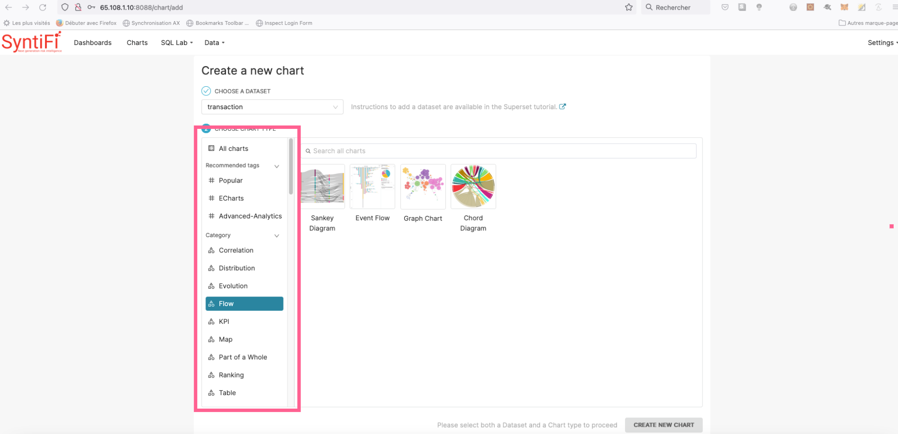

The reviewer was able to add a new 'Pie' chart reflecting the count of transaction having a given amount.

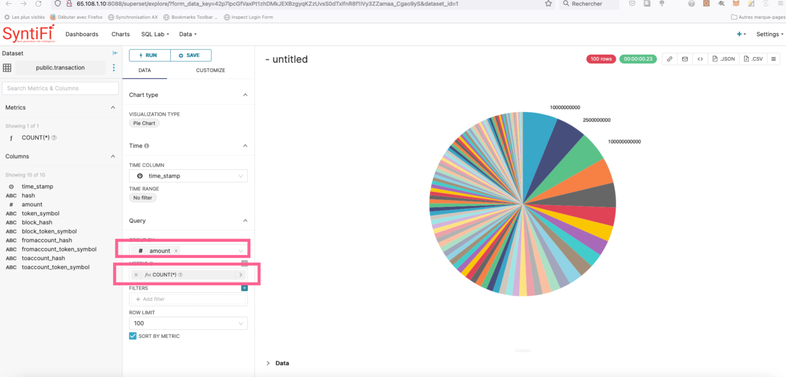


## Overall Impression of usage testing

While the Acceptance Criteria of "Have a working GraphQL API to successfully query all transactions from/to a given wallet to easily run the API" is minimally
met, and the project provides additional functionality in a REST API and includes helpful testing/configuration UIs, the project falls severely
short in providing the necessary documentation required to properly set up and run the project, or to properly use the provided APIs. Those APIs where for the usage
parameters were correctly inferred by Reviewer and thus tested, operated correctly.

Requirement | Finding
------------ | -------------
Project builds and runs without errors | PASS
Documentation provides sufficient installation/execution instructions | PASS
Project functionality meets/exceeds acceptance criteria and operates without error | PASS 


# Unit / Automated Testing
This part of the project uses Apache superSet to perform data analysis and exploration. 
There are currently no tools to perform automated tests on this platform. the reviewer was limited running the above test scenarios.

Based on last review , the project contains 24 unit tests accross all its modules . 
The tests can be executed from the console and cover both positive and negative test paths.

Requirement | Finding
------------ | -------------
Unit Tests - At least one positive path test | PASS
Unit Tests - At least one negative path test | PASS
Unit Tests - Additional path tests | PASS

# Documentation

### Code Documentation

TODO

The code in the project is essentially comment/documentation free, other than in the AMLRules.java class

Requirement | Finding
------------ | -------------
Low level function documentation | FAIL

### Project Documentation

TODO

As identified above, the project does NOT contain sufficient documentation describing the prerequisites and steps to set up, compile and run the project

Requirement | Finding
------------ | -------------
Sufficient Project Documentation | FAIL

### API Documentation

TODO

While some auto-generated API documentation is included, as identified above the lack of endpoint usage descriptions and/or input parameter format examples
has resulted in this Reviewer being unable to test certain API endpoint. As such, this requirement is not met.

Requirement | Finding
------------ | -------------
API documentation | FAIL

## Overall Conclusion on Documentation

TODO

Given the number of FAILs above, the overall conclusion has to be that this project falls short of the expected level of documentation.

# Open Source Practices

## Licenses

The Project is released under the MIT License

Requirement | Finding
------------ | -------------
OSI-approved open source software license | PASS

## Contribution Policies

The project contains a CONTRIBUTING policy that links to a Code of Conduct policy. Pull requests and Issues are enabled.

Requirement | Finding
------------ | -------------
OSS contribution best practices | PASS

# Coding Standards

## General Observations

TODO

Code is generally well-structured and very readable. The project as committed to GitHub cannot be run without finding the hidden workaround
of installing the Casper SDK Jar from file, nor can it properly be tested without spending hours of trial-and-error to infer
proper testing routes, parameter formats, etc. 

# Final Conclusion

TODO

The project provides the functionality described in the grant application and milestone acceptance criteria. 

The deliverable falls short in the following areas:
* Documentation

For a project of this magnitude, in both scope and cost, strict adherence to the minimal standards should be enforced, and therefore, it is this Reviewer's 
opinion that this milestone submission should fail, until the identified shortcomings are addressed. I do believe these are easily addressed, and I look forward
to reviewing the milestone again in the near future to re-assess my recommendation. Specifically, I believe the following items are critical to pass this review:

- Update the project documentation to ensure that someone who installs the listed pre-requisites and subsequently follows the outlined steps, ends up
with a working project 100% of the time.
- Update the project documenation to make clear how to use the project (e.g. upon completion of set-up, run initial synchronization before using the APIs)
- Update the API documentation with a description of the functionality of each endpoint, and an example value for each parameter from which the format can be inferred
- Improve the inline code documentation

# Recommendation

Recommendation | FAIL (request for improvements)
------------ | -------------

